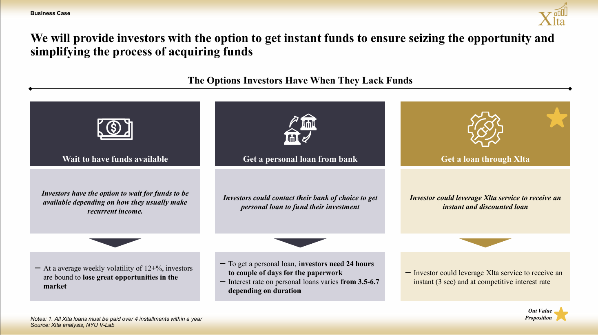

# XLTA Landing Page

## Task

### Description
Help me with creating a landing page for my start up XLTA make sure you include the slides in the landing page

### Tech Stack
Create the page in Next.js

### Aesthetics and themse
Please make sure the the page is white and gold llike the slides I have provded 
Make sure to have a nice gradient
- White: #FFFFFF
- Gold: #E6CB8E

### Contact
For Contact information make sure to ask people to reach out to the following X Account:
@xlta_ksa

or at our email:
xlta.startup@gmail.com

WE DONT HAVE ANY OTHER SOCIAL MEDIA ACCOUNTS
ASK PEOPLE TO REACH 

## About

This is a landing page for the start up XLTA.
XLTA is ensures that investors are always able to participate in the market by providing them invest now, pay later solutions.

### Business Problem

Investors struggnle to find enough funds to get into new positions in the market, leaving them to lose the oppurtonity on making 💵🤑🤑

The current solutions now are waiting for funds to comme out of thin air, or you next pay check 
OR getting a loan from the bank

### Solution:

We will provide investors with the option to get instant funds to ensure seizing the opportunity and simplifying the process of acquiring funds

XLTA offers Invest Now Pay Later solution that provide instant loans at competitive interest that can be paid over 4 payments

